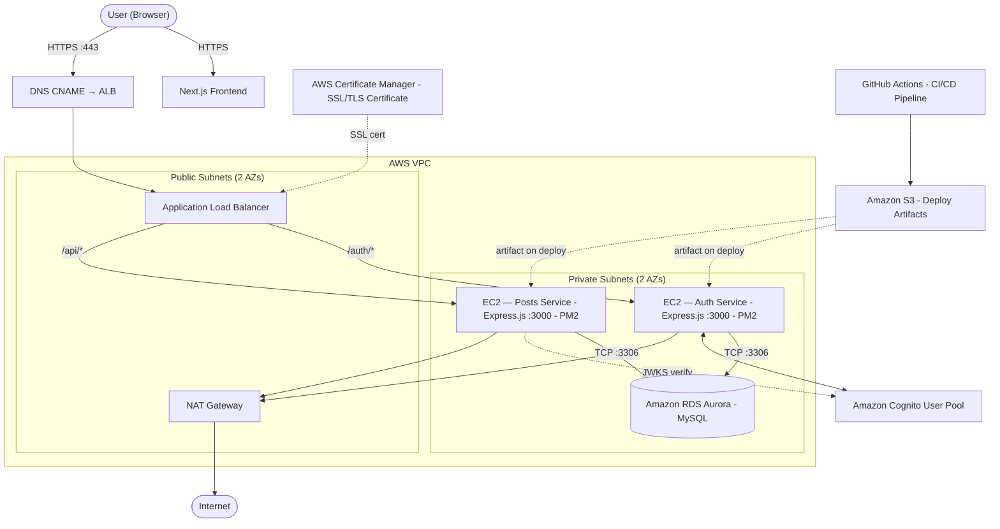

# Simple Threads

A full-stack social web application where users create text posts and respond via comments. Built on a modern cloud-native AWS backend with a Next.js frontend.

---

## Architecture Overview



---

## Backend Technologies

| Technology | Role |
|---|---|
| Node.js + Express.js on EC2 | Two private instances, one per microservice |
| PM2 | Process manager on EC2 — Keeps services alive, survives reboots |
| Amazon Cognito | User identity — Signup, email verification, login |
| Amazon RDS (Aurora MySQL) | Store users, posts, comments |
| AWS ALB | Public entry point — SSL termination, path-based routing |
| AWS ACM | Managed SSL/TLS certificate for custom domain (as opposed to using AWS API Gateway) to serve traffic over HTTPS |
| AWS VPC | Public and private subnet separation |
| AWS IAM | EC2 role scoped to SSM, Cognito, and RDS |
| AWS NAT Gateway | Outbound internet access for private EC2 instances |
| AWS S3 | Deploy artifact storage — compiled tarballs per deploy |
| AWS Systems Manager (SSM) | Secure EC2 access and remote deploy execution — no SSH |
| GitHub Actions | CI/CD — builds, uploads to S3, triggers SSM deploy |

---

## Microservices

The backend is split into two independent Express.js services, each on its own EC2 instance. The ALB routes traffic between them based on URL path prefix.

**Auth Service** (`/auth/*`) handles all identity concerns: account creation, email confirmation via Cognito, login, and signout.

**Posts Service** (`/posts/*`, `/comments/*`) handles content: creating posts and comments.

---

## Security Model

- EC2 instances have no public IP addresses and accept no inbound traffic from the internet
- The ALB is the sole public entry point, accepting only ports 80 and 443
- Security groups form a strict chain: `internet → ALB → EC2 → RDS` - each layer only accepts traffic from the layer directly above it
- EC2 instances are accessed by engineers via SSM Session Manager only — no SSH ports open
- IAM role on EC2 is scoped to the minimum required: SSM access, Cognito operations, and RDS connectivity
- RDS lives in a private subnet with no public access, reachable only from the EC2 security group

---

## CI/CD Pipeline

```
Push to main
    │
    ├── GitHub Actions
    │       ├── Install dependencies
    │       ├── Compile TypeScript → dist/
    │       ├── Package as .tar.gz
    │       ├── Upload artifact to S3
    │       └── Trigger SSM Execution
    │
    └── SSM Remote Execution (on each EC2)
            ├── Pull artifact from S3
            ├── Extract to service directory
            ├── npm ci --omit=dev
            └── pm2 reload (zero-downtime restart)
```
